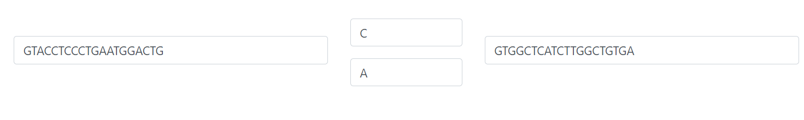
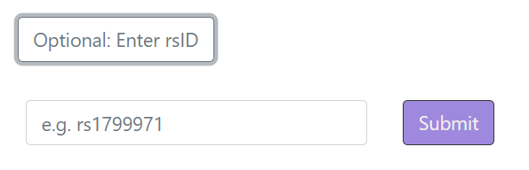
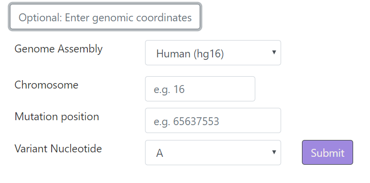

<p align="center">

  <h1 align="center">CRISPAM</h1>

  <p align="center">
    DNA sequence analysis tool to identify SNP-derived PAMs
    <br />
    Roy Rabinowitz,  Shiri Almog, Roy Darnell, and Daniel Offen
    <br/>
    <a href="http://danioffenlab.pythonanywhere.com/CRISPAM"><strong>Go to website >> </strong></a>
   
  </p>


<!-- TABLE OF CONTENTS -->
## Table of Contents

* [About](#ABOUT)
* [crispam_single.py](#built-with)
  * [Methods to Enter Data](#methods)
  * [Reading the Results](#reading-the-results-output)
* [Contact](#contact)

<!-- ABOUT  -->
## ABOUT
CrisPam is a pythonic tool for identifying novel PAMs generated by SNPs (SNP-derived PAMs) for allele-specific targeting by varying CRISPR/Cas systems. 
It is ideal for researchers willing to target a particular mutation or assessing the specific-targeting potential of several mutations. 
CrisPam is built as a webtool in which you may insert DNA sequences and obtain analysis of which CRISPR/Cas systems may best fit to specifically target the point mutation of your choice.  


The main script is:

## 1. crispam_single.py: 
This is the main script of the website. It receives a single query SNV, via 3 possible methods: <br> 

* <i> Manually entered by user:</i> <br> Here you must enter a 51-nt long DNA sequence, 25 nt upstream to the mutation and 25 nt downstream, as well as the variation and the reading frame. 

 
* <i> Fetch by given rsID: </i> Enters a known rsID. You will then be presented with a table containing all the possible variations. Once you selects one of the options, it will automatically be inserted into the format in (a). 


* <i> Fetch by genomic coordinates: </i> You may select a genome, chromosome number, mutation position, variation, and reading frame, which will be inserted into the format in (a).
 

**Note: Only one of these methods is required each time. **
 
CrisPam attempts to detect any of the defined PAMs as SNP-derived PAMs. However, on the advanced settings option, 
you may add a customized Cas with a unique PAM sequence in the **Advanced Options** section.
Once you click the Submit button, your results will immediately appear at the Results section.

#### Reading the results output
Each gray row represents a candidate Cas enzyme that can target the given point mutation. 
The variant nucleotide is in bold text and the PAM is in blue. You may click on the gray row to close and re-open the detailed results. 


<!-- GETTING STARTED -->
## Getting Started

To get a local copy up and running follow these simple steps.


### Installation
 
1. Clone the repo
```sh
git clone https://github.com/RoyRabinowitz/CrisPam
```
2. Install biopython packages
```sh
pip install biopython 
```


## Main Functions Details

 ### `match`(CAS,sequence,seq3len,rtrnLoc=False,specific=False)

Gets the full Sequence and CAS's PAM, returns Match if the PAM matches the Variant somewhere.  <br />
If rtrnLoc = True, returns location of the match instead of True, or False if none found <br />
Creates an SNP object, snp object, has attributes such as snp.mutation, snp.wildtype, snp.upstream_sequence, snp.downstream_sequence
#### Parameters:

*   **CAS** – String
*   **Variant** – String   
*   **Specific** – Boolean - check only the specific location given
*   **if rtrnLoc** – list with int locations; else Boolean


### `getRevComp`(snp)
Finds reverse complement of the SNP object, including changing its attirbutes respectively 

#### Parameters:
*   **snp** - snp object


## API

### `fetch_dna_coordinates`(genome, chromosome, startpos, endpos, cache_dir)
This function fetches sequence data, by inserting the parameters into the following url:
"http://genome.ucsc.edu/cgi-bin/das/{0}/dna?segment={1}:{2},{3}"

0 - genome

1 - chromosome

2- start position

3 - end position

#### Parameters:
*   **genome, chromosome,start position,end position** - relevent sequence information
*   **chache_dir** - the local directory to which the data will be saved


`
## Edit the CAS list
To change the CAS used for analysis, open the [Scripts/casDBFile_new.py](Scripts/baseEditorsTable.py) file

<!-- CONTACT -->
## Contact

Roy Rabinowitz - royr2@mail.tau.ac.il

Shiri Almog - shirialmog1@gmail.com

Roy Darnell - ristlin@gmail.com

Dani Offen - doffen@post.tau.ac.il

Website: [http://danioffenlab.pythonanywhere.com/CRISPAM](http://danioffenlab.pythonanywhere.com)

Project Link: [https://github.com/RoyRabinowitz/CrisPam](https://github.com/RoyRabinowitz/BE-FF)


